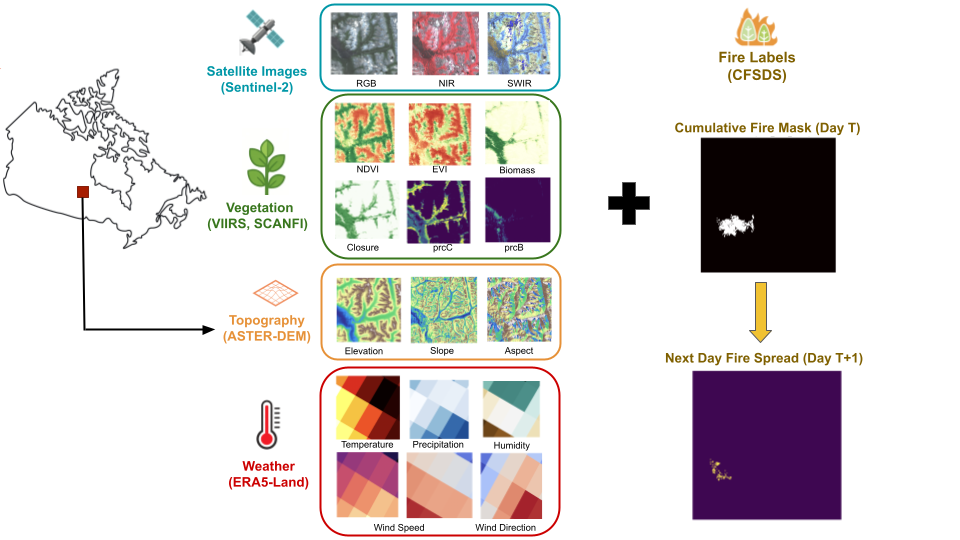

## CanadaWildfireDaily Dataset and Benchmark

  
<em align="center" > 

## Dataset download and code

The dataset is available for [download](https://huggingface.co/datasets/CanadaWildFireDaily/CanadaWildFireDaily-v1), and we release the [code](https://github.com/hagerradi/CanadaWildFireDaily) for building the dataset in other regions of the world and for the benchmark. \\

Citing
------
Coming soon

## Authors



  
  <a href="{{ person.url | relative_url }}">{{ person.name }}</a> 
  {{ person.title | replace: '&', ' ' }}
  <!--span>({{ person.topics }})</span-->



For questions, please contact us at:
<a href="mailto:hager.radi@mila.quebec">hager.radi@mila.quebec</a>

